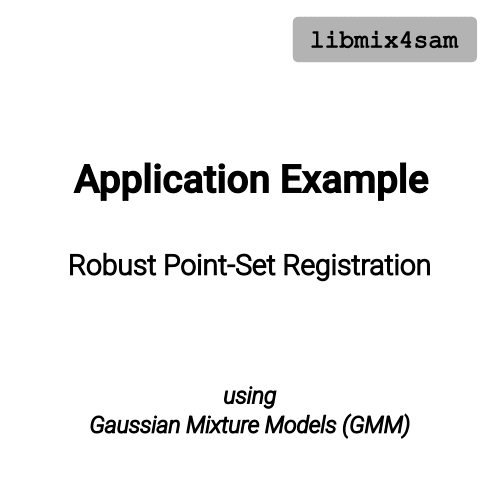

# Mixtures for Smoothing and Mapping Library (libMix4SAM)




libMix4SAM is extending the functionality of GTSAM [1].
It provides factors and noise models to implement robust state estimation using gaussian mixture distributions.

Further information can be found in the corresponding paper, see section "Citation", and our [project's landing page](https://mytuc.org/mix).

## Contact information
- [Sven Lange](https://www.tu-chemnitz.de/etit/proaut/sven_lange)
- [Tim Pfeifer](https://www.tu-chemnitz.de/etit/proaut/tim_pfeifer)
<br clear="right"/>

## License information
libmix4sam is free software: you can redistribute it and/or modify
it under the terms of the GNU General Public License as published by
the Free Software Foundation, either version 3 of the License, or
(at your option) any later version.

libmix4sam is distributed in the hope that it will be useful,
but WITHOUT ANY WARRANTY; without even the implied warranty of
MERCHANTABILITY or FITNESS FOR A PARTICULAR PURPOSE.  See the
GNU General Public License for more details.

You should have received a copy of the GNU General Public License
along with this software.  If not, see <http://www.gnu.org/licenses/>.

## Citation

If you use this library for academic work, please either cite the library or a corresponding paper:
<details>
<summary>BibTeX of libmix4sam</summary>

```tex
  @Misc{libmix4sam,
   author       = {Sven Lange and Others},
   title        = {libmix4sam},
   howpublished = {\url{https://github.com/TUC-ProAut/libmix4sam}}
  }
```

</details>

<details>
<summary>Accompanying Paper</summary>

* Pfeifer, Tim, Sven Lange, and Peter Protzel (2021) [Advancing Mixture Models for Least Squares Optimization](http://arxiv.org/abs/2103.02472). arXiv:2103.02472 [cs] (to appear in IEEE Robotics and Automation Letters)

</details>

## How to compile
The following two subsections describe how to build libmix4sam in combination with a local build of gtsam. As there are some specifics to the gtsam build, we will start with this.

<details>
<summary>Compile gtsam locally for libmix4sam</summary>

First, download specific release of gtsam
```bash
❯ git clone https://github.com/borglab/gtsam.git gtsam403-src
❯ cd gtsam403-src && git checkout 4.0.3 && cd ..
```
Than configure and compile
```bash
❯ mkdir gtsam403-build && cd gtsam403-build
❯ cmake -C <libmix4sam-src>/gtsamConfig.cmake -S ../gtsam403-src 
❯ make -j2
```
> **Note:** We need some specific options for compiling gtsam. They are invoked through using the `gtsamConfig.cmake` as pre-load option for cmake. Further explanation can be found directly within the `*.cmake` file.

> **Note2:** For easy use later on, we recommend to stick to the naming convention used above for source and build folder of gtsam.
</details>

<details open>
<summary>Compile libmix4sam</summary>
Change to the source folder of libmix4sam.

```bash
❯ mkdir build && cd build
❯ cmake .. -DGTSAM_BUILD_DIR=<path-to-gtsam403-build-directory>
❯ make -j2
```

</details>

## Example
The file `examples/testPsr2DFactor.cpp` implements a very simple 2D registration example using a GMM for the fixed point set.

More advanced examples are implemented in MATLAB, see the `matlab` directory. (COMMING SOON)

To use the library in MATLAB, add it to the search path:
```Matlab
❯ path( path, fullfile(<Path-to-lib-src>, 'matlab') );
❯ libmix4sam.configurePath(<Path-to-lib-src>);
```
To test the functionality, there is the same example as above implemented in MATLAB, see `matlab/tests/testPsr2DFactor.m`.

## Additional notes

> **LM-Algorithm:** 
> In between the gtsam versions 4.0 and 4.0.3, the stopping criteria calculation of the Levenberg-Marquardt algorithm changed (this regards the file `gtsam/nonlinear/LevenbergMarquardtOptimizer.cpp`). To get the same results as in our published experiments, the mentioned file has to be replaced by the version from gtsam release 4.0.

> **Matlab-Wrapper:** If MATLAB is complaining about 'Missing symbol's while loading the wrapper, it usually helps starting matlab with changed `LD_PRELOAD` environment variable as follows:
>```bash
>❯ LD_PRELOAD="/usr/lib/x86_64-linux-gnu/libstdc++.so.6" matlab
>```

> **Error-Modeling:** Be careful in modelling the mixture components. E.g. if you model an ambiguous measurement with three possible modes all into the mean for the gaussian components and use zero for the factor, it may lead to an indeterminate system. If you instead use one mean as measurement and shift the remaining means accordingly, the system may be solvable again.  

## Known bugs
* The new GMM noise model won't work till now with GTSAM's BearingRangeFactor (and RangeFactor / BearingFactor), which are based on the ExpressionFactor. If you need it, you could use the older versions of these factors from GTSAM 3.2.3.

## References

[1] GTSAM 4.0 https://gtsam.org


